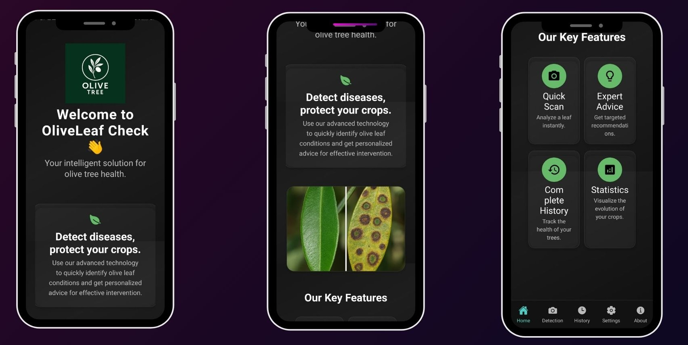
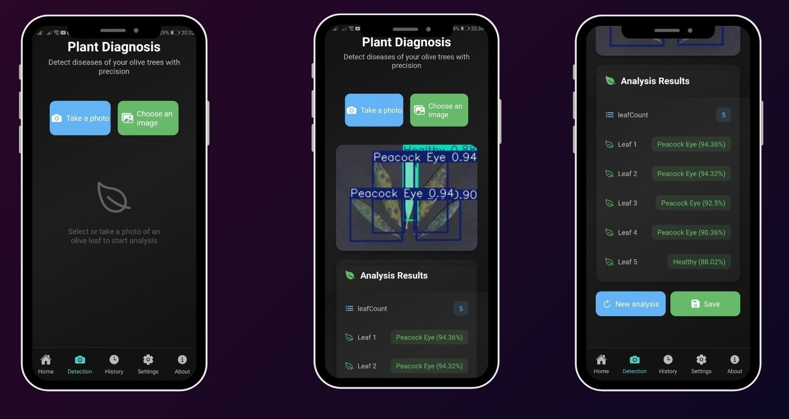
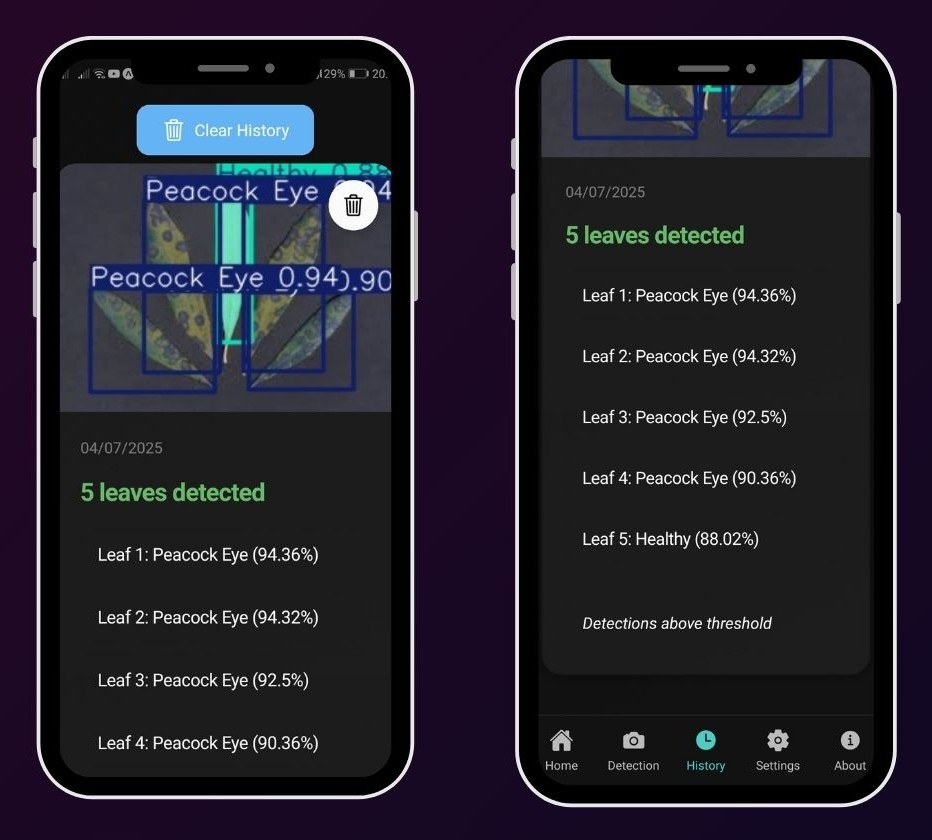
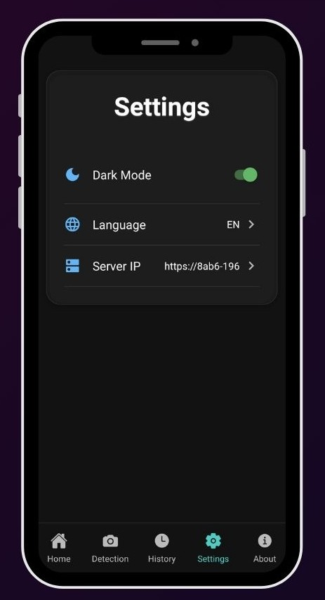
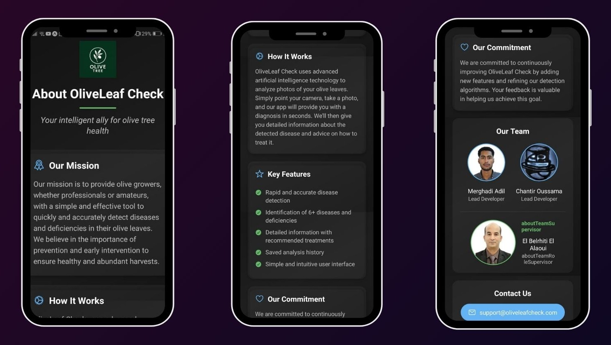

# 🌿 OliveLeaf Check

Application mobile intelligente pour détecter les maladies des feuilles d’olivier.

## 📱 Pages principales

### 🏠 Accueil


### 📷 Détection


### 🕓 Historique


### ⚙️ Paramètres


### ℹ️ À propos


## 🧰 Technologies
- React Native (Expo)
- Flask (Python)
- YOLOv8 (Ultralytics)
- SQLite

## 🚀 Lancement

```bash
cd mobile
npm install
npx expo start
